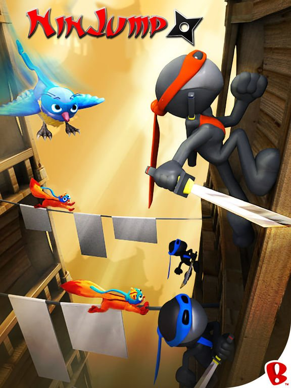
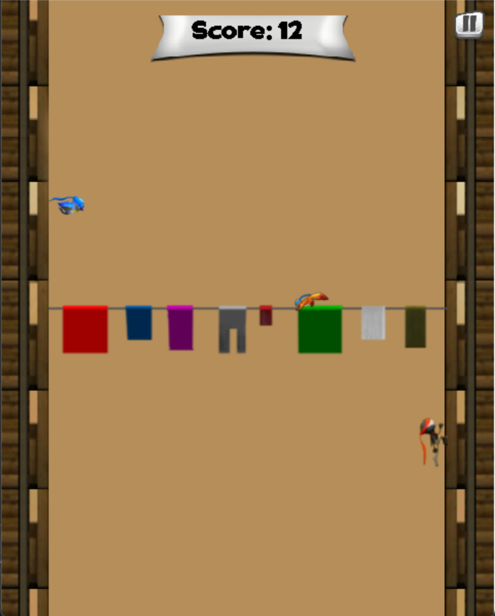

# Ninja Jump 🥷



**Ninja Jump** là một game 2D siêu thú vị, nơi bạn điều khiển một ninja nhanh nhẹn 🏃‍♂️, nhảy để tiêu diệt hoặc né chướng ngại vật ⚡, kẻ địch 🥷 nhằm sinh tồn đến cuối cùng và đạt điểm cao nhất ! Với đồ họa vui nhộn 🌈 và lối chơi cuốn hút, game mang đến trải nghiệm giải trí tuyệt vời cho mọi lứa tuổi! 🌟

---

## 📜 Mục lục

- [Giới thiệu](#giới-thiệu)
- [Cấu trúc game](#cấu-trúc-game)
- [Chức năng chính](#chức-năng-chính)
- [Cách chơi](#cách-chơi)

---

## 🌟 Giới thiệu

**Ninja Jump** là một game platform 2D nơi bạn nhập vai một ninja 🥷 vượt qua các platform đầy thử thách. Né tránh cạm bẫy nguy hiểm 🕸️ và sống sót càng lâu càng tốt để đạt kỷ lục! Game có lối chơi đơn giản, đồ họa bắt mắt 🎨, phù hợp cho tất cả mọi lứa tuổi! 🎮



---

## 🏗️ Cấu trúc game

Game được xây dựng với cấu trúc đơn giản, dễ mở rộng, sử dụng ngôn ngữ C++ và các thư viện mở rộng như SDL2, SDL2_Ttf,... . Cấu trúc thư mục chính như sau:

```
ninja_jump/
├── main.cpp              # Hàm main, điều khiển vòng lặp game và xử lý trạng thái chính
├── commonFunc.h/.cpp     # Khởi tạo SDL, load tài nguyên, render text, quản lý high score, âm thanh, màu sắc,...
├── ninja.h/.cpp          # Class ninja, điều khiển nhân vật, nhảy, hoạt ảnh
├── obstacle.h/.cpp       # Class Obstacle, quản lý các loại vật cản như bird, rope, shield,...
├── button.h/.cpp         # Class button, xử lý các nút như Play, Quit, Pause,...
├── res/                  # Thư mục chứa toàn bộ tài nguyên (asset) của game
│   ├── background/       # Hình nền game
│   ├── button/           # Hình ảnh các nút bấm
│   ├── font/             # Font chữ sử dụng để hiển thị điểm, menu,...
│   ├── menu/             # Hình ảnh giao diện menu, game over,...
│   └── sound/            # Âm thanh: nhạc nền và hiệu ứng
├── highscore.txt         # File lưu điểm cao nhất
└── README.md             # Giới thiệu các thông tin về game

```


---

## 🎯 Chức năng chính

- **Menu cài đặt** ⚙️: giúp người chơi có thể dễ dàng cài đặt game theo ý thích.
- **Menu tạm dừng** ⏸️: Khi cần nghỉ tay, lo việc hệ trọng hay... bắt đầu lại cuộc đời 🎭 — bạn hoàn toàn có thể tạm dừng trò chơi. Từ đây, bạn cũng có thể quay lại màn hình chính để điều chỉnh cài đặt hoặc chuẩn bị cho lần chơi tiếp theo một cách thoải mái.
- **Điều khiển nhân vật** 🕴️: Ninja có thể nhảy để di chuyển trái/phải, với cơ chế vật lý mượt mà.
- **Chướng ngại vật** 🚧: Trò chơi có đa dạng các chướng ngại vật được thiết kế để thử thách kỹ năng và phản xạ của người chơi. Mỗi loại mang một đặc trưng riêng, khiến hành trình trở nên kịch tính và bất ngờ. Ví dụ như:
  - **Gai nhọn** ✶: Xuất hiện ngẫu nhiên, khiến người chơi phải phản ứng nhanh nếu không muốn "game over".
  - **Kẻ địch** 🥷: ném phi tiêu 𖣘 thẳng vào người chơi.
  - **Chim săn mồi** 🐦: Quan sát kỹ di chuyển của người chơi rồi lao tới tấn công chính xác.
  - **Sóc nhanh nhẹn** 🐿️: Di chuyển qua lại với tốc độ cao, buộc người chơi phải căn thời gian thật chuẩn để vượt qua.
- **Khiên hỗ trợ** 🛡️: giúp cho người chơi **thoát hiểm trong gang tấc** - khi bị tấn công hoặc va chạm với vật cản,khiên có thể bảo vệ người chơi khỏi một lần bị game over. Giúp người chơi có cơ hội thứ hai tiếp tục cuộc hành trình và lập nên kỷ lục mới 🎯 !!!
- **Hệ thống điểm số** 🏆: Lưu điểm hiện tại và cao nhất của mình.
- **Đồ họa và âm thanh** 🎵: Hình ảnh 2D sinh động, kết hợp âm thanh các hành động, âm thanh nhạc nền vô cùng vui nhộn.

---

## 🎮 Cách chơi

- **Điều khiển**:
  - Nhấn **phím Space** để nhảy 🕴️.
- **Mục tiêu**:
  - Nhảy tránh chướng ngại vật như gai ✶ hoặc kẻ thù 🥷🦊 .
  - Thu thập khiên 🛡️ để bảo vệ mạng sống của mình.
  - Sống sót lâu nhất để đạt điểm cao và khoe với bạn bè! 🏅


